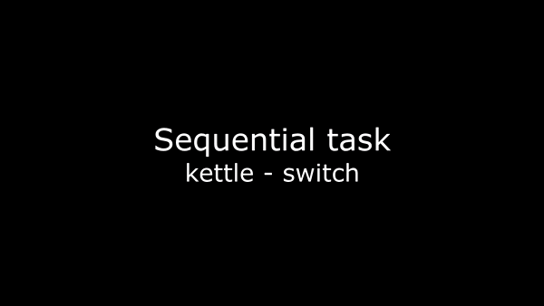

# Learning Robot Skills from Video

This implementation is based on the paper by: Lynch et al., "Learning Latent Plans from Play", 2019.
https://learning-from-play.github.io/

The purpose of this project is to make a robot capable of performing many different complex tasks without having to relearn each from scratch in a continuous setting.

## Videos and models


You can find our trained models and video results of our implementation in the following link
https://drive.google.com/drive/folders/1X2LBbLa2RBjLQEEP1bqxm035ok_Oab34?usp=sharing

## Visualize training error and validation plots
Our current model was trained over 1 day and 16 hours, you can visualize the plots inside analysis/plots or in tensorboard by running the following command
```console
foo@bar:~$ tensorboard --logdir ./runs
```
## Requirements
To run this project it is required to have a working installation of Mujoco 2.0, further information can be found on the following webpage: https://www.roboti.us/index.html
* Train:
  * Pytorch: https://pytorch.org/get-started/locally/
  * Tensorboard: pip install tensorboard
  * Numpy: pip install numpy
  * Matplotlib: pip install matplotlib
  * Scipy: pip install scipy
  * CV2: pip install opencv-python
* Additional packages for running the test environment:
  * tqdm: pip install tqdm
  * mjrl: https://github.com/aravindr93/mjrl
  * puppet: https://github.com/vikashplus/puppet
  * relay-policy-learning env: https://github.com/google-research/relay-policy-learning

Please make sure that the "mjrl", "puppet" and "relay-policy-learning" folders are in the root folder of the project before executing the environment.

## How to run
### Train
To train a model you will need to define the appropiate constant values in /utils/constants.py after that execute the command:
```console
foo@bar:~$ python training.py
```
The model with the best accuracy and best training loss will be saved under the folder /models

### t-SNE Analysis
We created this script to analyze the latent plan space representation 
```console
foo@bar:~$ python tsne_analysis.py
```
The resulting plots and images will be saved under analysis/temporal_tsne.

### Test
To visualize the model performance on consecutive tasks run the following script:
```console
foo@bar:~$ python test_consecutive.py
```

To visualize the model performance on a single task run the following script:
```console
foo@bar:~$ python test_single_goal.py
```
To further modify the specifications please check the python files which include a more
detailed information on the parameters used. 
Videos will be saved under "./analysis/videos/model_trials/__goal_name__".

## Contact
For any other question or feedback, please send an email to:
* erickrosetebeas@hotmail.com
* jessicalizethborja@gmail.com
* guttikondasuresh7@gmail.com

We will be happy to help you.
